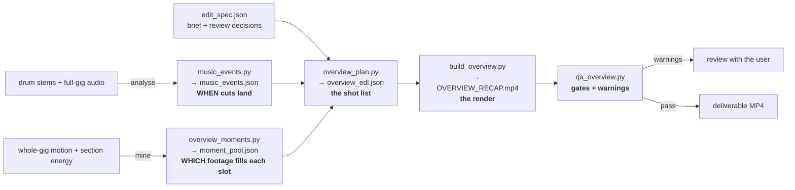

# Gig-Overview Recap — Architecture

Turns raw multi-camera gig footage into a ~48-second, vertical (9:16), Instagram-style
**whole-gig recap**, cut to a music bed. This document is the simple map of how it works and
the locked "cutting technique" it must not drift from.

## Pipeline — 5 stages

| Stage | Script | Input → Output | Job |
|---|---|---|---|
| 1 | `music_events.py`* | stems → `music_events.json` | detect the drum events + bars + intent anchors (WHEN) |
| 2 | `overview_moments.py` | motion+sections → `moment_pool.json` | rank the best moments across ALL songs (WHICH footage) |
| 3 | `overview_plan.py` | spec+events+pool → `overview_edl.json` | build the shot list under the laws below |
| 4 | `build_overview.py` | EDL → `OVERVIEW_RECAP.mp4` | render (grades held across cuts, effects, 60fps) |
| 5 | `qa_overview.py` | render+EDL → report | hard gates + soft warnings for review |

\* event map produced by the analysis scripts (frame-aligned, stem-separated).
Per-gig data (`edit_spec.json`, `music_events.json`, `moment_pool.json`, footage) is **local /
gitignored** — only the generic tool is committed.

## The cutting technique — the locked "essence" (do not deviate unless told)

1. **SYNC LAW.** Every cut lands on a **real drum hit the ear tracks** (kick / crash / backbeat
   snare), lead-corrected ~12 ms to the true attack. Zero wasted transitions — no cut without an
   audible justification. Verified against the *actual mix*, not just detected stem hits.
2. **Felt beat, not ghosts.** Cut on on-beat hits + crashes; **skip syncopated ghost kicks**.
3. **Bar-aligned sectioning.** Sections start on **bar downbeats**. Fast build cuts begin *at the
   bar*, never spill early. Shape: calm pre-build → fast build → resolve **on** the crash/drop.
4. **Non-uniform pacing.** Steady where the music is steady (intro pulse, build); dynamic
   elsewhere; ≥1 deliberate hero-hold per groove. Energy is a **curve**, not a metronome.
5. **Long-form effects.** One colour grade **held across the cuts** (energy from cuts, unity from
   colour); sustained looks dominate screen-time; short stabs only on the sharpest hits.
6. **Cross-gig footage.** Footage mined from **all songs**; the bed is one anchor song's audio.
7. **Intent anchors.** A specific request ("cut on the double-snare", "beat before the drop") is
   stored as a **named anchor** and hit exactly; QA verifies each landed on its anchor.
8. **60 fps.** Source is 60 fps — render at 60 for tight cut placement + smooth motion
   (`OV_FPS=30` falls back).

## QA — two layers + a warning channel

- **Hard gates (pass/fail):** `SYNC-LANDING`, `MIX-COUPLING`, `BUILDS-LAND`, `PACING-SHAPE`,
  `CROSS-GIG`, `EFFECT-BALANCE`, `AV-LOCK`, `NO-TEXT`.
- **Warnings (surfaced for review, never silently patched):** an intent anchor missed by >45 ms,
  a section-seam sliver, an effect-decoupled cut. These are raised to the user to decide.
- **The QA grows.** Add a gate whenever a new lesson is learned; prune obsolete ones. A bug that
  slipped through means a missing gate, not just a one-off patch.

## Why it's built this way (lessons paid for)
- Cutting on an abstract beat-grid or on *any* onset felt random → cut on **real, felt** hits.
- Verifying only against our own detected times hid a systematic lag → **verify against the mix**.
- Sections starting on detected events (not bars) let fast cuts spill early → **bar-align**.
- Heuristic placement ("strongest kick nearby") missed specific requests → **intent anchors**.
- Silent bandaids (sliver-merge) hid sectioning bugs → **fix the cause, warn on the symptom**.
